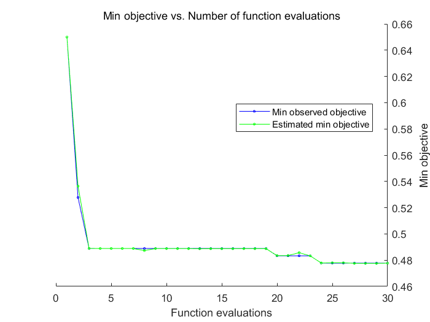

> # 传统机器学习训练记录
-----------------------------
## SVM多分类
### 默认设置
```matlab
Mdl = fitcecoc(X,Y);
```
- **test accuracy = 87.9%**


### 自动优化
```matlab
rng default;
Mdl = fitcecoc(X,Y,'OptimizeHyperparameters','auto',...
'HyperparameterOptimizationOptions',struc('AcquisitionFunctionName',...
    'expected-improvement-plus'));
```
> 
> | Iter | Eval result| Objective | Objective runtime | BestSoFar (observed)| BestSoFar (estim.) |Coding | BoxConstraint| 
> |------|------------|-----------|------------------|----------------------|-------------------|-------|---------------|
> |    1 | Best   |       0.65 |     1.4411 |       0.65 |      0.65 |     onevsall |    0.0089562 |       310.42 |
> |    2 | Best   |    0.52778 |     51.544 |    0.52778 |  0.53642 |     onevsone |       67.106 |    0.0053534 |
> |    3 | Best   |    0.48889 |     7.6541 |    0.48889 |    0.48899 |     onevsall |    0.0027084 |     0.017254 |
> |    4 | Accept |    0.48889 |    0.70206 |    0.48889 |    0.48889 |     onevsall |       259.06 |      0.14755 |
> |    5 | Accept |    0.53889 |     134.79 |    0.48889 |    0.48889 |     onevsall |     0.017881 |    0.0010015 |
> |    6 | Accept |    0.53333 |      2.528 |    0.48889 |    0.48889 |     onevsone |       15.471 |       2.7444 |
> |    7 | Accept |    0.58333 |     2.1616 |    0.48889 |    0.48889 |     onevsone |     0.048046 |       999.99 |
> |    8 | Accept |    0.48889 |    0.84498 |    0.48889 |    0.48731 |     onevsall |    0.0040902 |     0.051195 |
> |    9 | Accept |    0.48889 |    0.85276 |    0.48889 |    0.48885 |     onevsall |       148.89 |     0.049289 |
> |   10 | Accept |    0.53333 |     2.6336 |    0.48889 |    0.48884 |     onevsone |     0.032199 |      0.11352 |
> |   11 | Accept |    0.48889 |    0.83889 |    0.48889 |    0.48884 |     onevsall |       140.03 |      0.62821 |
> |   12 | Accept |    0.48889 |    0.84338 |    0.48889 |    0.48883 |     onevsall |      0.28158 |      0.34472 |
> |   13 | Accept |    0.48889 |    0.82866 |    0.48889 |    0.48869 |     onevsall |       4.7423 |     0.027044 |
> |   14 | Accept |    0.48889 |    0.85907 |    0.48889 |    0.48878 |     onevsall |       71.152 |      0.43436 |
> |   15 | Accept |    0.48889 |    0.68861 |    0.48889 |    0.48877 |     onevsall |       186.94 |     0.025847 |
> |   16 | Accept |    0.48889 |    0.67433 |    0.48889 |    0.48877 |     onevsall |      0.77002 |      0.09161 |
> |   17 | Accept |    0.48889 |      0.682 |    0.48889 |    0.48882 |     onevsall |     0.035859 |      0.44505 |
> |   18 | Accept |    0.48889 |     2.9932 |    0.48889 |     0.4888 |     onevsall |     0.011678 |      0.02498 |
> |   19 | Accept |    0.48889 |    0.65479 |    0.48889 |     0.4888 |     onevsall |     0.033749 |      0.22163 |
> |   20 | Best   |    0.48333 |    0.64406 |    0.48333 |    0.48346 |     onevsall |    0.0026697 |       1.2454 |
> |   21 | Accept |    0.48889 |    0.67178 |    0.48333 |    0.48352 |     onevsall |       37.114 |       3.2152 |
> |   22 | Accept |    0.48889 |    0.66813 |    0.48333 |    0.48571 |     onevsall |       3.8793 |       1.7063 |
> |   23 | Accept |    0.48333 |    0.76221 |    0.48333 |    0.48327 |     onevsall |    0.0014964 |       1.3841 |
> |   24 | Best   |    0.47778 |    0.64316 |    0.47778 |    0.47784 |     onevsall |    0.0010006 |       3.9343 |
> |   25 | Accept |    0.48889 |     0.6048 |    0.47778 |    0.47798 |     onevsall |    0.0010187 |       5.8114 |
> |   26 | Accept |    0.53889 |     203.07 |    0.47778 |    0.47798 |     onevsone |    0.0025289 |     0.001002 |
> |   27 | Accept |    0.47778 |     0.6605 |    0.47778 |    0.47761 |     onevsall |    0.0010188 |       3.0414 |
> |   28 | Accept |    0.58333 |     2.0672 |    0.47778 |    0.47759 |     onevsone |    0.0010593 |       32.015 |
> |   29 | Accept |    0.48889 |     64.057 |    0.47778 |    0.47759 |     onevsall |       753.16 |    0.0056094 |
> |   30 | Accept |    0.47778 |    0.73914 |    0.47778 |     0.4777 |     onevsall |    0.0013483 |       3.2567 |
> 
> Optimization completed.
> MaxObjectiveEvaluations of 30 reached.
> Total function evaluations: 30
> Total elapsed time: 521.7604 seconds.
> Total objective function evaluation time: 488.8007
> 
> Best observed feasible point:
> |Coding     |BoxConstraint    |KernelScale|
> | -------  |  -------   | -------|
> |onevsall  |  0.0010006  |3.9343   |  
> 
> Observed objective function value = 0.47778
> Estimated objective function value = 0.4777
> Function evaluation time = 0.64316
> 
> Best estimated feasible point (according to models):
> |Coding     |BoxConstraint    |KernelScale|
> | -------  |  -------   | -------|
> |onevsall   | 0.0013483   |     3.2567     |
> 
> Estimated objective function value = 0.4777
> Estimated function evaluation time = 0.68514
- **test accuracy = 86.1%**
### 线性核函数 
> 已经调整lambda到最优
```matlab
t = templateLinear('Lambda',0.008);
Mdl = fitcecoc(X',Y,'Learners',t,'ObservationsIn','columns');
```
- **test accuracy=87.0%**
### 常规核函数
```matlab
t = templateSVM('Standardize',1);
Mdl = fitcecoc(X,Y,'Learners',t);
```
- **test accuracy=86.5%**

