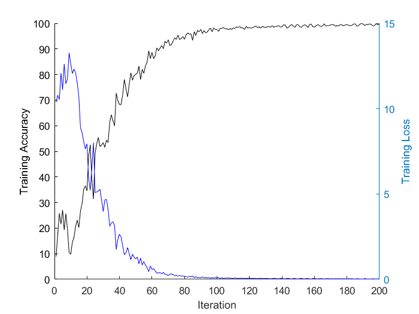
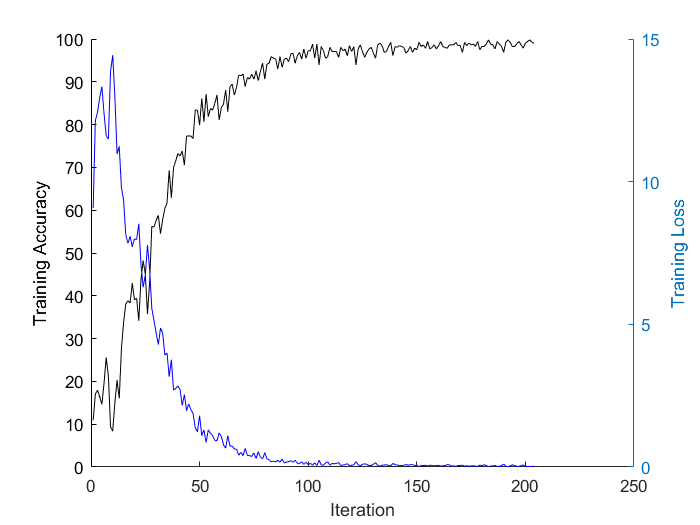
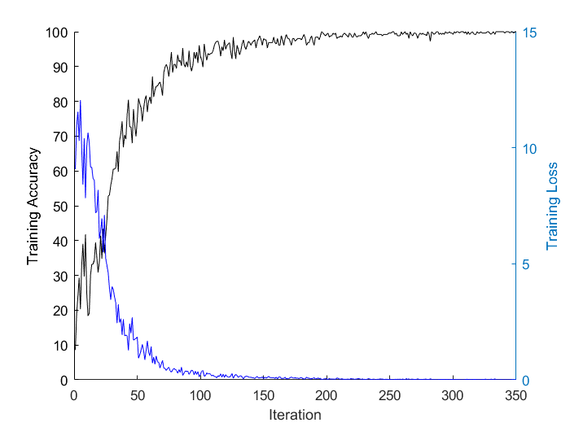
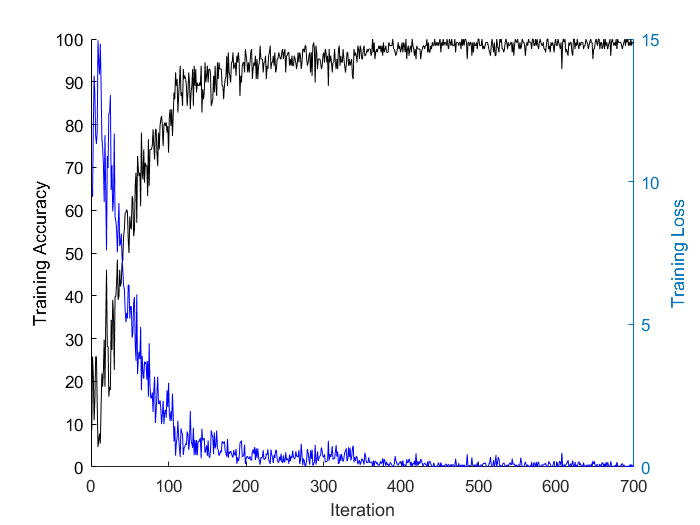
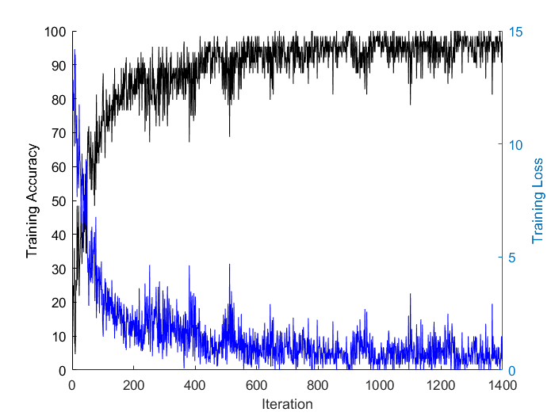
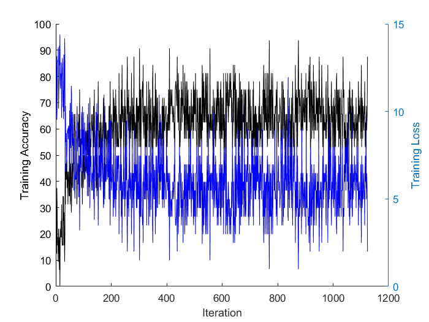
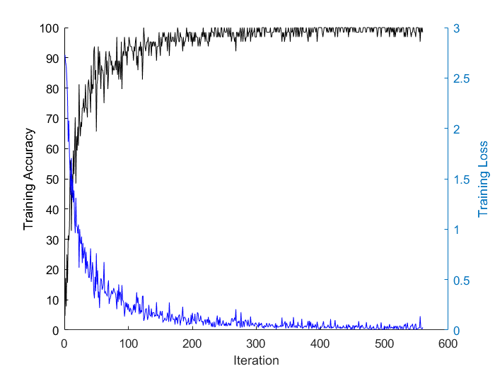
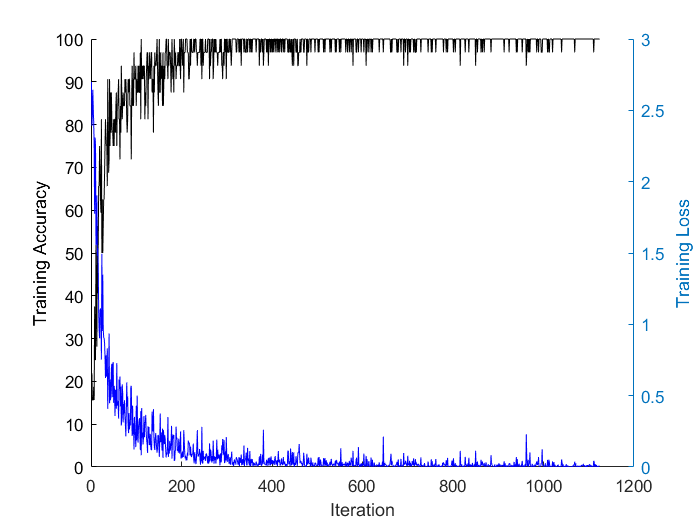
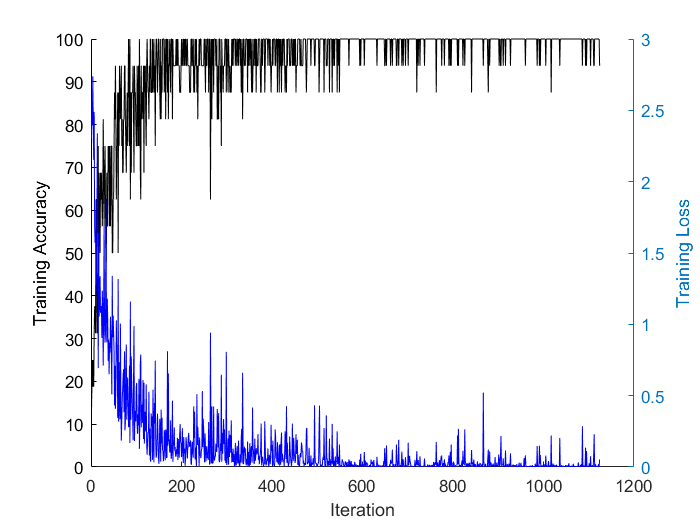

> # 迁移学习训练记录
-----------------------
## matlab自带网络LettersClassificationNet
### 网络架构

> The layer number|Layer name|Function|The detailed information
> |--|----------------|-----------------------|-------------------------------------|
> |1  | 'imageinput'   | Image Input           |     28x28x1images with 'zerocenter' normalization
> |2  | 'conv'         | Convolution           |     20 5x5x1 convolutions with stride [1  1] and padding [0  0]
> |3  |'relu'          | ReLU                  |     ReLU
> |4  | 'maxpool'      | Max Pooling           |     2x2 max pooling with stride [2  2] and padding [0  0]|
> |5  | 'fc'           | Fully Connected       |     3 fully connected layer
> |6   |'softmax'      | Softmax               |     softmax
> |7  | 'classoutput'  | Classification Output |      crossentropyex with 'A', 'B', and 1 other classes

### minibatchsize=1024
> 
> Epoch|Iteration  |Time Elapsed (seconds)|Mini-batch Loss|Mini-batch Accuracy|Base Learning Rate     
> |------|---------------|-----------|---------|---------|--------|
> |            1 |            1 |         0.43 |      10.3815 |        8.89% |     1.00e-04 |
> |            7 |           50 |        11.80 |       1.1990 |       80.08% |     1.00e-04 |
> |           13 |          100 |        22.97 |       0.0803 |       97.56% |     1.00e-04 |
> |           19 |          150 |        34.32 |       0.0213 |       99.41% |     1.00e-04 |
> |           25 |          200 |        45.58 |       0.0164 |       99.90% |     1.00e-04 |

- **test accuracy=98.2%**

### minibatchsize=512
> 
> |Epoch    |Iteration  |Time Elapsed (seconds) |             Mini-batch Loss |Mini-batch Accuracy  | Base Learning      Rate     
> |------|---------------|-----------|---------|---------|--------|
> |            1 |            1 |         0.30 |       9.0723 |       10.94% |     1.00e-04 |
> |            3 |           50 |         6.38 |       1.8000 |       79.88% |     1.00e-04 |
> |            6 |          100 |        12.70 |       0.0792 |       97.27% |     1.00e-04 |
> |            9 |          150 |        18.78 |       0.0503 |       97.46% |     1.00e-04 |
> |           12 |          200 |        25.06 |       0.0246 |       99.02% |     1.00e-04 |
> |           12 |          204 |        25.53 |       0.0301 |       99.02% |     1.00e-04 |

- **test accuracy=96.9%**

### minibatchsize=256
> 
> |Epoch    |Iteration  |Time Elapsed (seconds) |             Mini-batch Loss |Mini-batch Accuracy  | Base Learning      Rate     
> |------|---------------|-----------|---------|---------|--------|
> |            1 |            1 |         0.22 |       9.4737 |        9.38% |     1.00e-04 |
> |            2 |           50 |         3.90 |       3.8101 |       61.33% |     1.00e-04 |
> |            3 |          100 |         7.46 |       0.2313 |       96.09% |     1.00e-04 |
> |            5 |          150 |        11.28 |       0.1362 |       95.31% |     1.00e-04 |
> |            6 |          200 |        15.62 |       0.1610 |       96.48% |     1.00e-04 |
> |            8 |          250 |        19.49 |       0.0215 |       99.22% |     1.00e-04 |
> |            9 |          300 |        23.33 |       0.0120 |       99.61% |     1.00e-04 |
> |           10 |          350 |        26.97 |       0.0043 |      100.00% |     1.00e-04 |

- **test accuracy=98.7%**

###  minibatchsize=128
> 
> |Epoch    |Iteration  |Time Elapsed (seconds) |             Mini-batch Loss |Mini-batch Accuracy  | Base Learning      Rate     
> |------|---------------|-----------|---------|---------|--------|
> |            1 |            1 |         0.19 |       9.6988 |        8.59% |     1.00e-04 |
> |            1 |           50 |         2.49 |       5.2054 |       58.59% |     1.00e-04 |
> |            2 |          100 |         4.76 |       2.9492 |       73.44% |     1.00e-04 |
> |            3 |          150 |         7.12 |       0.3905 |       93.75% |     1.00e-04 |
> |            3 |          200 |         9.44 |       0.2984 |       96.09% |     1.00e-04 |
> |            4 |          250 |        11.72 |       0.1837 |       97.66% |     1.00e-04 |
> |            5 |          300 |        13.99 |       0.3473 |       96.88% |     1.00e-04 |
> |            5 |          350 |        16.23 |       0.2789 |       95.31% |     1.00e-04 |
> |            6 |          400 |        18.65 |       0.0948 |       97.66% |     1.00e-04 |
> |            7 |          450 |        21.27 |       0.0001 |      100.00% |     1.00e-04 |
> |            8 |          500 |        23.84 |       0.0003 |      100.00% |     1.00e-04 |
> |            8 |          550 |        26.27 |       0.0001 |      100.00% |     1.00e-04 |
> |            9 |          600 |        28.59 |       0.0428 |       98.44% |     1.00e-04 |
> |           10 |          650 |        30.92 |       0.0341 |       99.22% |     1.00e-04 |
> |           10 |          700 |        33.22 |       0.0136 |       99.22% |     1.00e-04 |

- **test accuracy=97.9%**

###  minibatchsize=64
> 
> |Epoch    |Iteration  |Time Elapsed (seconds) |             Mini-batch Loss |Mini-batch Accuracy  | Base Learning      Rate     
> |------|---------------|-----------|---------|---------|--------|
> |            1 |            1 |         0.17 |      11.2860 |        6.25% |     1.00e-04 |
> |            1 |           50 |         1.86 |       5.0531 |       64.06% |     1.00e-04 |
> |            1 |          100 |         3.45 |       1.7705 |       84.38% |     1.00e-04 |
> |            2 |          150 |         5.10 |       2.4956 |       84.38% |     1.00e-04 |
> |            2 |          200 |         6.76 |       2.2250 |       81.25% |     1.00e-04 |
> |            2 |          250 |         8.34 |       2.8564 |       78.13% |     1.00e-04 |
> |            3 |          300 |         9.96 |       2.9302 |       76.56% |     1.00e-04 |
> |            3 |          350 |        11.55 |       1.0511 |       92.19% |     1.00e-04 |
> |            3 |          400 |        13.16 |       3.2475 |       75.00% |     1.00e-04 |
> |            4 |          450 |        14.78 |       1.8389 |       84.38% |     1.00e-04 |
> |            4 |          500 |        16.39 |       1.6494 |       89.06% |     1.00e-04 |
> |            4 |          550 |        17.99 |       2.4786 |       82.81% |     1.00e-04 |
> |            5 |          600 |        19.60 |       1.4064 |       90.63% |     1.00e-04 |
> |            5 |          650 |        21.22 |       1.9401 |       85.94% |     1.00e-04 |
> |            5 |          700 |        22.82 |       0.7488 |       95.31% |     1.00e-04 |
> |            6 |          750 |        24.45 |       0.8646 |       93.75% |     1.00e-04 |
> |            6 |          800 |        26.06 |       0.2761 |       96.88% |     1.00e-04 |
> |            7 |          850 |        27.70 |       0.4982 |       96.88% |     1.00e-04 |
> |            7 |          900 |        29.33 |       0.2593 |       98.44% |     1.00e-04 |
> |            7 |          950 |        30.95 |       1.6493 |       89.06% |     1.00e-04 |
> |            8 |         1000 |        32.57 |       0.0000 |      100.00% |     1.00e-04 |
> |            8 |         1050 |        34.21 |       1.0704 |       92.19% |     1.00e-04 |
> |            8 |         1100 |        35.82 |       3.3897 |       78.13% |     1.00e-04 |
> |            9 |         1150 |        37.49 |       0.4982 |       96.88% |     1.00e-04 |
> |            9 |         1200 |        39.10 |       0.4983 |       96.88% |     1.00e-04 |
> |            9 |         1250 |        40.72 |       0.9374 |       93.75% |     1.00e-04 |
> |           10 |         1300 |        42.35 |       1.2523 |       92.19% |     1.00e-04 |
> |           10 |         1350 |        43.97 |       0.7473 |       95.31% |     1.00e-04 |
> |           10 |         1400 |        45.58 |       1.4946 |       90.63% |     1.00e-04 |

- **test accuracy=94.4%**

###  minibatchsize=32
> 
> |Epoch    |Iteration  |Time Elapsed (seconds) |             Mini-batch Loss |Mini-batch Accuracy  | Base Learning      Rate     
> |------|---------------|-----------|---------|---------|--------|
> |            1 |            1 |         0.16 |       9.0913 |       15.63% |     1.00e-04 |
> |            1 |           50 |         1.45 |      10.0577 |       34.38% |     1.00e-04 |
> |            1 |          100 |         2.59 |       9.9640 |       37.50% |     1.00e-04 |
> |            1 |          150 |         3.74 |       7.9712 |       50.00% |     1.00e-04 |
> |            1 |          200 |         4.93 |       7.9712 |       50.00% |     1.00e-04 |
> |            1 |          250 |         6.09 |       5.9784 |       62.50% |     1.00e-04 |
> |            2 |          300 |         7.26 |       7.4730 |       53.13% |     1.00e-04 |
> |            2 |          350 |         8.41 |       2.4910 |       84.38% |     1.00e-04 |
> |            2 |          400 |         9.57 |       5.9784 |       62.50% |     1.00e-04 |
> |            2 |          450 |        10.74 |       5.4802 |       65.63% |     1.00e-04 |
> |            2 |          500 |        11.92 |       5.4802 |       65.63% |     1.00e-04 |
> |            2 |          550 |        13.10 |       8.9676 |       43.75% |     1.00e-04 |
> |            3 |          600 |        14.29 |       6.9748 |       56.25% |     1.00e-04 |
> |            3 |          650 |        15.47 |       8.4694 |       46.88% |     1.00e-04 |
> |            3 |          700 |        16.64 |       6.4766 |       59.38% |     1.00e-04 |
> |            3 |          750 |        17.83 |       2.4910 |       84.38% |     1.00e-04 |
> |            3 |          800 |        19.01 |       5.9784 |       62.50% |     1.00e-04 |
> |            4 |          850 |        20.21 |       4.4838 |       71.88% |     1.00e-04 |
> |            4 |          900 |        21.39 |       4.9820 |       68.75% |     1.00e-04 |
> |            4 |          950 |        22.55 |       1.9928 |       87.50% |     1.00e-04 |
> |            4 |         1000 |        23.74 |       5.9784 |       62.50% |     1.00e-04 |
> |            4 |         1050 |        24.97 |       7.4730 |       53.13% |     1.00e-04 |
> |            4 |         1100 |        26.16 |       6.9748 |       56.25% |     1.00e-04 |
> |            4 |         1124 |        26.71 |       1.9928 |       87.50% |     1.00e-04 |

- **test accuracy=53.1%**
-------------------------------

## Alexnet
### 网络架构

> |The layer number|Layer name|Function|The detailed information
> |---|-----------|-------------------------------|-------------------------------------|
> 1   |'data'     |Image Input                   |227x227x3 images with 'zerocenter' normalization
> 2   |'conv1'    |Convolution                   |96 11x11x3 convolutions with stride [4  4] and padding [0  0]
> 3   |'relu1'    |ReLU                          |ReLU
> 4   |'norm1'    |Cross Channel Normalization   |cross channel normalization with 5 channels per element
> 5   |'pool1'    |Max Pooling                   |3x3 max pooling with stride [2  2] and padding [0  0]
> 6   |'conv2'    |Convolution                   |256 5x5x48 convolutions with stride [1  1] and padding [2  2]
> 7   |'relu2'    |ReLU                          |ReLU
> 8   |'norm2'    |Cross Channel Normalization   |cross channel normalization with 5 channels per element
> 9   |'pool2'    |Max Pooling                   |3x3 max pooling with stride [2  2] and padding [0  0]
> 10   |'conv3'    |Convolution                   |384 3x3x256 convolutions with stride [1  1] and padding [1  1]
> 11   |'relu3'    |ReLU                          |ReLU
> 12   |'conv4'    |Convolution                   |384 3x3x192 convolutions with stride [1  1] and padding [1  1]
> 13   |'relu4'    |ReLU                          |ReLU
> 14   |'conv5'    |Convolution                   |256 3x3x192 convolutions with stride [1  1] and padding [1  1]
> 15   |'relu5'    |ReLU                          |ReLU
> 16   |'pool5'    |Max Pooling                   |3x3 max pooling with stride [2  2] and padding [0  0]
> 17   |'fc6'      |Fully Connected               |4096 fully connected layer
> 18   |'relu6'    |ReLU                          |ReLU
> 19   |'drop6'    |Dropout                       |50% dropout
> 20   |'fc7'      |Fully Connected               |4096 fully connected layer
> 21   |'relu7'    |ReLU                          |ReLU
> 22   |'drop7'    |Dropout                       |50% dropout
> 23   |'fc8'      |Fully Connected               |1000 fully connected layer
> 24   |'prob'     |Softmax                       |softmax
> 25   |'output'   |Classification Output         |crossentropyex with 'tench', 'goldfish', and 998 other classes

### minibatchsize=64

> 
> |Epoch    |Iteration  |Time Elapsed (seconds) |             Mini-batch Loss |Mini-batch Accuracy  | Base Learning      Rate     
> |------|---------------|-----------|---------|---------|--------|
> |            1 |            1 |         1.91 |       2.7291 |        4.69% |     1.00e-04 |
> |            1 |           50 |        92.82 |       0.7612 |       65.63% |     1.00e-04 |
> |            1 |          100 |       185.65 |       0.2581 |       92.19% |     1.00e-04 |
> |            2 |          150 |       277.71 |       0.1898 |       90.63% |     1.00e-04 |
> |            2 |          200 |       369.72 |       0.1709 |       93.75% |     1.00e-04 |
> |            2 |          250 |       464.28 |       0.0433 |      100.00% |     1.00e-04 |
> |            3 |          300 |       557.12 |       0.0560 |       96.88% |     1.00e-04 |
> |            3 |          350 |       649.99 |       0.0186 |      100.00% |     1.00e-04 |
> |            3 |          400 |       744.43 |       0.0306 |      100.00% |     1.00e-04 |
> |            4 |          450 |       838.16 |       0.0094 |      100.00% |     1.00e-04 |
> |            4 |          500 |       931.77 |       0.0423 |      100.00% |     1.00e-04 |
> |            4 |          550 |      1025.14 |       0.0032 |      100.00% |     1.00e-04 |
> |            4 |          560 |      1043.69 |       0.0258 |       98.44% |     1.00e-04 |

- **test accuracy=100%**

### minibatchsize=32
> 
> |Epoch    |Iteration  |Time Elapsed (seconds) |             Mini-batch Loss |Mini-batch Accuracy  | Base Learning      Rate     
> |------|---------------|-----------|---------|---------|--------|
> |            1 |            1 |         1.99 |       2.6998 |       15.63% |     1.00e-04 |
> |            1 |           50 |        56.63 |       0.4494 |       81.25% |     1.00e-04 |
> |            1 |          100 |       111.90 |       0.4292 |       84.38% |     1.00e-04 |
> |            1 |          150 |       168.45 |       0.1547 |       93.75% |     1.00e-04 |
> |            1 |          200 |       224.36 |       0.0936 |      100.00% |     1.00e-04 |
> |            1 |          250 |       280.24 |       0.0691 |       96.88% |     1.00e-04 |
> |            2 |          300 |       335.70 |       0.0802 |      100.00% |     1.00e-04 |
> |            2 |          350 |       391.53 |       0.0099 |      100.00% |     1.00e-04 |
> |            2 |          400 |       447.57 |       0.0430 |      100.00% |     1.00e-04 |
> |            2 |          450 |       503.43 |       0.0061 |      100.00% |     1.00e-04 |
> |            2 |          500 |       559.25 |       0.0074 |      100.00% |     1.00e-04 |
> |            2 |          550 |       615.32 |       0.0040 |      100.00% |     1.00e-04 |
> |            3 |          600 |       670.99 |       0.0218 |      100.00% |     1.00e-04 |
> |            3 |          650 |       726.83 |       0.0173 |      100.00% |     1.00e-04 |
> |            3 |          700 |       782.87 |       0.0786 |       93.75% |     1.00e-04 |
> |            3 |          750 |       838.62 |       0.0071 |      100.00% |     1.00e-04 |
> |            3 |          800 |       894.45 |       0.0031 |      100.00% |     1.00e-04 |
> |            4 |          850 |       950.56 |       0.1134 |       93.75% |     1.00e-04 |
> |            4 |          900 |      1005.82 |       0.0017 |      100.00% |     1.00e-04 |
> |            4 |          950 |      1061.21 |       0.0036 |      100.00% |     1.00e-04 |
> |            4 |         1000 |      1117.07 |       0.0029 |      100.00% |     1.00e-04 |
> |            4 |         1050 |      1172.41 |       0.0195 |      100.00% |     1.00e-04 |
> |            4 |         1100 |      1227.68 |       0.0118 |      100.00% |     1.00e-04 |
> |            4 |         1124 |      1254.24 |       0.0078 |      100.00% |     1.00e-04 |

- **test accuracy=100%**

### minibatchsize=16
> 
> |Epoch    |Iteration  |Time Elapsed (seconds) |             Mini-batch Loss |Mini-batch Accuracy  | Base Learning      Rate     
> |------|---------------|-----------|---------|---------|--------|
> |            1 |            1 |         0.95 |       2.3046 |       12.50% |     1.00e-04 |
> |            1 |           50 |        40.78 |       0.9377 |       62.50% |     1.00e-04 |
> |            1 |          100 |        81.85 |       0.5615 |       75.00% |     1.00e-04 |
> |            1 |          150 |       122.88 |       0.0221 |      100.00% |     1.00e-04 |
> |            1 |          200 |       163.46 |       0.0694 |      100.00% |     1.00e-04 |
> |            1 |          250 |       204.25 |       0.1167 |      100.00% |     1.00e-04 |
> |            1 |          300 |       244.78 |       0.0138 |      100.00% |     1.00e-04 |
> |            1 |          350 |       285.32 |       0.0053 |      100.00% |     1.00e-04 |
> |            1 |          400 |       325.85 |       0.1541 |       93.75% |     1.00e-04 |
> |            1 |          450 |       366.17 |       0.0748 |       93.75% |     1.00e-04 |
> |            1 |          500 |       406.46 |       0.0073 |      100.00% |     1.00e-04 |
> |            1 |          550 |       448.08 |       0.0241 |      100.00% |     1.00e-04 |
> |            2 |          600 |       490.57 |       0.0276 |      100.00% |     1.00e-04 |
> |            2 |          650 |       531.78 |       0.0629 |       93.75% |     1.00e-04 |
> |            2 |          700 |       572.23 |       0.0071 |      100.00% |     1.00e-04 |
> |            2 |          750 |       612.80 |       0.0090 |      100.00% |     1.00e-04 |
> |            2 |          800 |       653.20 |       0.0005 |      100.00% |     1.00e-04 |
> |            2 |          850 |       693.71 |       0.0136 |      100.00% |     1.00e-04 |
> |            2 |          900 |       734.39 |       0.0025 |      100.00% |     1.00e-04 |
> |            2 |          950 |       774.92 |       0.0297 |      100.00% |     1.00e-04 |
> |            2 |         1000 |       816.06 |       0.0004 |      100.00% |     1.00e-04 |
> |            2 |         1050 |       859.13 |       0.0089 |      100.00% |     1.00e-04 |
> |            2 |         1100 |       900.59 |       0.0030 |      100.00% |     1.00e-04 |
> |            2 |         1124 |       920.11 |       0.0531 |       93.75% |     1.00e-04 |

- **test accuracy=99.8%**
